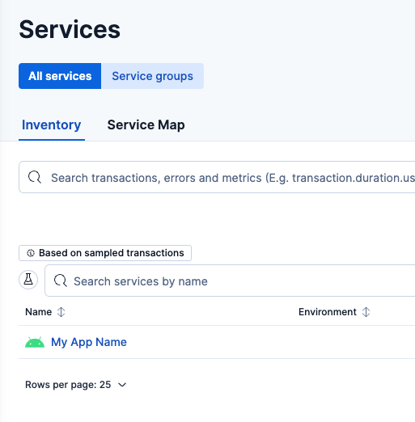
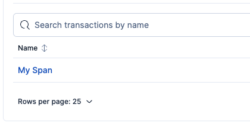
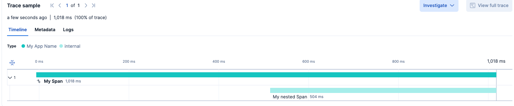

---
mapped_pages:
  - https://www.elastic.co/guide/en/apm/agent/android/current/setup.html
---

# Getting started

Set up an agent in your app and explore your app's data in {{kib}}.

## Requirements

| Requirement                                       | Minimum version                                                                                           |
|---------------------------------------------------|-----------------------------------------------------------------------------------------------------------|
| [{{stack}}](https://www.elastic.co/elastic-stack) | 8.18                                                                                                      |
| Android Gradle plugin                             | 7.4.0                                                                                                     |
| Android API level                                 | 26 (or 21 with [desugaring](https://developer.android.com/studio/write/java8-support#library-desugaring)) |

:::{important} - Apps with minSdk below 26
If your application's [minSdk](https://developer.android.com/studio/publish/versioning#minsdk) value is lower than 26, you **must** add [Java 8 desugaring support](https://developer.android.com/studio/write/java8-support#library-desugaring).

Refer to the [FAQ](faq.md#why-desugaring) for more information.
:::

## Gradle setup

Add the [Elastic OTel Agent plugin](https://plugins.gradle.org/plugin/co.elastic.otel.android.agent) to your application’s `build.gradle[.kts]` file:

```kotlin
plugins {
    id("com.android.application")
    id("co.elastic.otel.android.agent") version "[latest_version]" // <1>
}
```

1. You can find the latest version [here](https://plugins.gradle.org/plugin/co.elastic.otel.android.agent).

## Agent setup

After Gradle setup is done, initialize the agent within your app's code:

```kotlin
val agent = ElasticApmAgent.builder(application) // <1>
    .setServiceName("My app name") // <2>
    .setExportUrl("http://10.0.2.2:4318") // <3>
    .setExportAuthentication(Authentication.ApiKey("my-api-key")) // <4>
    .build()
```

1. Your [Application](https://developer.android.com/reference/android/app/Application) object. [Get your application object](how-tos.md#get-application).
2. In OpenTelemetry, _service_ means _an entity that produces telemetry_, so this is where your application name should go. Refer to the [FAQ](faq.md#why-service) for more information.
3. This is the Elastic endpoint where all your telemetry will be exported. [Get your Elastic endpoint](how-tos.md#get-export-endpoint).
4. Use an API key to connect the agent to the {{stack}}. [Create an API key](how-tos.md#create-api-key).

:::{include} _snippets/tip-provide-values-from-outside.md
:::

## Hello World!

The agent is fully initialized, so now you can start sending telemetry to your {{stack}}! Here's a quick example of manually creating a [span](https://opentelemetry.io/docs/concepts/signals/traces/#spans) and viewing it in {{kib}}:

### Generate telemetry

```kotlin
val agent = ElasticApmAgent.builder(application)
    .setServiceName("My app name")
    //...
    .build()


agent.span("My Span") {
    Thread.sleep(500) // <1>
    agent.span("My nested Span") { // <2>
        Thread.sleep(500)
    }
}
```
1. This is to simulate some code execution for which we want to measure the time it takes to complete.
2. This is to demonstrate what span hierarchies look like in {{kib}}.

### Visualize telemetry

Once your app has sent telemetry data, either [manually](manual-instrumentation.md) or [automatically](automatic-instrumentation.md), view it in {{kib}} by navigating to **Applications** → **Service Inventory** in the main menu, or alternatively, searching for "Service Inventory" in the [global search field](docs-content://explore-analyze/find-and-organize/find-apps-and-objects.md).

You should find your application listed there.

% TO DO: Use `:class: screenshot`
% TO DO: Use `:width: 350px`


When you open it, go to the **Transactions** tab, where you should see your app's "outermost" spans listed.

% TO DO: Use `:class: screenshot`
% TO DO: Use `:width: 350px`


After clicking on the span, you should see it in detail.

% TO DO: Use `:class: screenshot`


## What’s next? [whats-next]

- This guide uses the minimum configuration options needed to initialize the agent. If you'd like to explore what else you can customize, take a look at the [configuration page](configuration.md).

- In the [simple example](#hello-world), you've _manually_ sent a span, so you've created some [manual instrumentation](manual-instrumentation.md) for your app. While helpful and flexible, the agent can also create _automatic instrumentations_. This means that by simply initializing the agent, it will start sending telemetry data on your behalf without you having to write code. For more details, refer to [Automatic instrumentation](automatic-instrumentation.md).

- [Spans](https://opentelemetry.io/docs/concepts/signals/traces/#spans) are a great way to measure how long some method, _part_ of a method, or even some broader transaction that involves multiple methods takes to complete. However, **spans aren't the only type** of [signal](https://opentelemetry.io/docs/concepts/signals/) that you can send using the agent. You can send [logs](https://opentelemetry.io/docs/concepts/signals/logs/) and [metrics](https://opentelemetry.io/docs/concepts/signals/metrics/) too! For more details, refer to [Manual instrumentation](manual-instrumentation.md).
