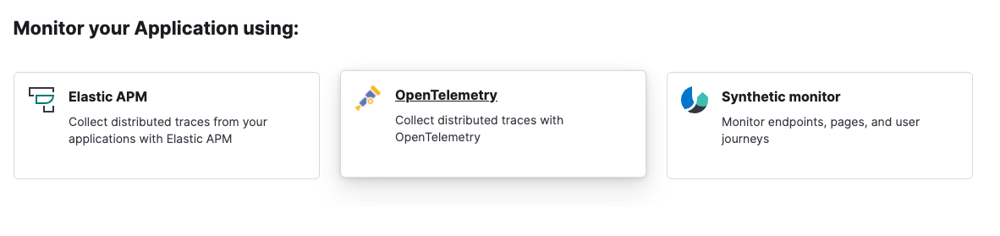
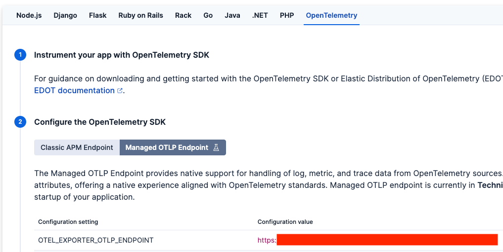
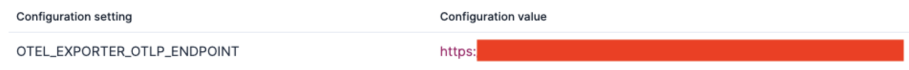

# How-tos

## How to get my Android application instance [get-application]

Your [Application](https://developer.android.com/reference/android/app/Application) instance is needed to initialize the agent. There are a couple of ways you can get yours:

### From within your custom Application implementation (recommended)

Ideally, the agent should get initialized as soon as your application is launched to make sure that it can start collecting telemetry from the very beginning.

Based on the above, an ideal place to do so is from within your own, custom [Application.onCreate](https://developer.android.com/reference/android/app/Application#onCreate()) method implementation, as shown below:

```kotlin
package my.app

class MyApp : Application() {
    override fun onCreate() {
        super.onCreate()
        val agent = ElasticApmAgent.builder(this) // <1>
            //...
            .build()
    }
}
```
1. `this` is your application.

:::{important}
For it to work, you **must** register your custom application in your `AndroidManifest.xml` file, like so:
```xml
<?xml version="1.0" encoding="utf-8"?>
<manifest xmlns:android="http://schemas.android.com/apk/res/android">
    <application
        android:name="my.app.MyApp"
        ...
    </application>
</manifest>
```
:::

### From an Activity

You can get your application from an [Activity](https://developer.android.com/reference/android/app/Activity) by calling its [getApplication()](https://developer.android.com/reference/android/app/Activity#getApplication()) method.

### From a Fragment
From a [Fragment](https://developer.android.com/reference/androidx/fragment/app/Fragment.html) instance, you can get the [Activity](https://developer.android.com/reference/android/app/Activity) that it is associated to by calling its [requireActivity()](https://developer.android.com/reference/androidx/fragment/app/Fragment.html#requireActivity()) method. Once you get the Activity object, you can get your application from it as [explained above](#from-an-activity).

## How to get my {{stack}} export endpoint [get-export-endpoint]

The export endpoint is where your app's telemetry is sent, so it's required to initialize the agent. The way to find it in your {{stack}} will depend on the type of deployment you use, as explained below.

### For Serverless deployments

On a [Serverless deployment](https://www.elastic.co/guide/en/serverless/current/intro.html), open {{kib}} and find **Add data** in the main menu. Alternatively, you can use the [global search field](docs-content://explore-analyze/find-and-organize/find-apps-and-objects.md) and search for "Observability Onboarding".

Then select **Application**, as shown below:

% TO DO: Use `:class: screenshot`


Choose **OpenTelemetry**:

% TO DO: Use `:class: screenshot`


On the next page, select the **OpenTelemetry** tab, followed by **Managed OTLP Endpoint** under "Configure the OpenTelemetry SDK":

% TO DO: Use `:class: screenshot`


Your export endpoint URL is the value for the **`OTEL_EXPORTER_OTLP_ENDPOINT`** configuration setting:

% TO DO: Use `:class: screenshot`


### For Cloud Hosted and self-managed deployments

For [Cloud Hosted](https://www.elastic.co/guide/en/cloud/current/ec-getting-started.html) and [self-managed](https://www.elastic.co/guide/en/elastic-stack/current/overview.html) deployments, the export endpoint (also known as [EDOT Collector](https://elastic.github.io/opentelemetry/edot-collector/index.html)) is not available out of the box at the moment. You can still create your own service by following [creating and configuring a standalone EDOT Collector](https://elastic.github.io/opentelemetry/edot-collector/config/default-config-standalone.html).

## How to create an API Key [create-api-key]

API Keys are the recommended way of authenticating the agent with your {{stack}}. There's a couple of ways you can create one:

### Use {{kib}}'s Applications UI

This is the most straightforward approach. Follow [this quick guide](docs-content://solutions/observability/apm/api-keys.md#apm-create-an-api-key) and leave all the settings with their default values.

### Use REST APIs

Follow [this guide](https://www.elastic.co/docs/api/doc/kibana/operation/operation-createagentkey) to create an API Key with a set of privileges that are scoped for the APM Agent use case only.

## How to provide config values from outside of my code?

You many want to get values such as an endpoint URL or API Key/Secret Token from a local file in your project directory or an environment variable (or both).

The Android Gradle plugin has you covered with its [build config fields](https://developer.android.com/build/gradle-tips#share-custom-fields-and-resource-values-with-your-app-code), which provide a way to share Gradle info with your app's Kotlin/Java code. Since Gradle has access to your project directory and to the compilation's host environment, you can share a lot with it from your code. The following are some possible use cases.

### Providing data from an environment variable

```kotlin
// Your app's build.gradle.kts file
plugins {
    // ...
}

val url = System.getenv("MY_ENV_WITH_MY_URL") // <1>
val apiKey = System.getenv("MY_ENV_WITH_MY_KEY")

android {
    // ...
    buildFeatures.buildConfig = true // <2>

    defaultConfig { // <3>
        // ...
        buildConfigField("String", "MY_EXPORT_URL", "\"$url\"")
        buildConfigField("String", "MY_EXPORT_API_KEY", "\"$apiKey\"")
    }
}
```

1. Since the `build.gradle.kts` files are written using [Kotlin](https://kotlinlang.org/) code, you can get your environment variables the same way you would with regular Kotlin sources. The same applies to `build.gradle` files, which work with [Groovy](https://groovy-lang.org/) instead.
2. Ensure Android's `buildConfig` feature is enabled.
3. Adding our build config fields to the `android.defaultConfig` block ensures they're available for all of your app's build variants. You could also, if needed, create fields with the same name but different values for each of your build variants, as shown in Android's [official docs](https://developer.android.com/build/gradle-tips#share-custom-fields-and-resource-values-with-your-app-code), to provide different values per variant.

You've properly created build config fields from environment variables. To use them in code, take a look at how to [read build config fields](#reading-build-config-fields) in code.

### Providing data from a properties file

[Properties](https://docs.oracle.com/javase/8/docs/api/java/util/Properties.html) are a common way to provide values to JVM apps through files (they're even mentioned for Android cases such as [storing keystore info](https://developer.android.com/studio/publish/app-signing#secure-shared-keystore)). Here's an example of how you could use them to provide config values to the agent.

Given the following example properties file:

```properties
my.url=http://localhost
my.api.key=somekey
```

This is what your `build.gradle.kts` configuration should look like:

```kotlin
// Your app's build.gradle.kts file
import java.util.Properties

plugins {
    // ...
}

val myPropertiesFile = project.file("myfile.properties") // <1>
val myProperties = Properties().apply {
    myPropertiesFile.inputStream().use { load(it) }
}

val url = myProperties["my.url"]
val apiKey = myProperties["my.api.key"]

android {
    // ...
    buildFeatures.buildConfig = true // <2>

    defaultConfig { // <3>
        // ...
        buildConfigField("String", "MY_EXPORT_URL", "\"$url\"")
        buildConfigField("String", "MY_EXPORT_API_KEY", "\"$apiKey\"")
    }
}
```

1. Your file path, provided here, is relative to your `build.gradle.kts` file (where this code is written). So in this example, both files (our `build.gradle.kts` and `myfile.properties`) are located in the same directory.
2. Ensure Android's `buildConfig` feature is enabled.
3. Adding your build config fields to the `android.defaultConfig` block ensures they're available for all of your app's build variants. You could also, if needed, create fields with the same name but different values for each of your build variants, as shown in Android's [official docs](https://developer.android.com/build/gradle-tips#share-custom-fields-and-resource-values-with-your-app-code), to provide different values per variant.

You've properly created build config fields from a properties file. To use them in code, refer to [read build config fields](#reading-build-config-fields) in code.

### Reading build config fields in code [reading-build-config-fields]

After adding [build config fields](https://developer.android.com/build/gradle-tips#share-custom-fields-and-resource-values-with-your-app-code) in your `build.gradle.kts` file, you may now use them within your app's Kotlin/Java code, by following these steps:

1. Compile your project. The build config fields are generated during compilation, so this step is required so that you can find them in your code later.
2. Find them within your app's `BuildConfig` generated type, as shown below.

```kotlin
import my.app.namespace.BuildConfig // <1>
// ...

fun myMethod() {
    val agent = ElasticApmAgent.builder(application)
        // ...
        .setExportUrl(BuildConfig.MY_EXPORT_URL)
        .setExportAuthentication(Authentication.ApiKey(BuildConfig.MY_EXPORT_API_KEY))
        .build()
}
```

1. There might be multiple `BuildConfig` types available to use in your code. The one that belongs to your app has a package name equal to your [app's namespace](https://developer.android.com/build/configure-app-module#set-namespace) value. So, for example, if your app's namespace is set to `com.my.app`, then the `BuildConfig` type you must use would be `com.my.app.BuildType`.

## How to configure SSL/TLS? [how-ssl]

Note that the Elastic Agent does not handle SSL/TLS configs internally. Therefore, you should manage these types of configurations as part of your app’s network security configurations, as explained in Android’s official [security guidelines](https://developer.android.com/privacy-and-security/security-ssl). Below we show a set of common use cases and quick tips on what could be done on each one. However, each case might be different, so please refer to Android’s [official docs](https://developer.android.com/privacy-and-security/security-config) on this topic if you need more details.

### Connecting to Elastic Cloud [how-ssl-elastic-cloud]

If your {{stack}} is hosted in {{ecloud}}, you shouldn’t need to add any SSL/TLS config changes in your app. It should work out of the box.

### Connecting to an on-prem server [how-ssl-on-prem]

If your {{stack}} is hosted on-prem, then it depends on the type of CA your host uses to sign its certificates. If it’s a commonly trusted CA, you shouldn’t have to worry about changing your app’s SSL/TLS configuration as it all should work well out of the box. However, if your CAs are unknown/private or your server uses a self-signed certificate, then you would need to configure your app to trust custom CAs by following [Android’s guide](https://developer.android.com/privacy-and-security/security-config).

### Debugging purposes [how-ssl-debug]

If you’re running a local server and need to connect to it without using https in order to run a quick test, then you could temporarily [enable cleartext traffic](https://developer.android.com/guide/topics/manifest/application-element#usesCleartextTraffic) within your `AndroidManifest.xml` file, inside the `<application>` tag. As shown below:

```xml
<application
    ...
    android:usesCleartextTraffic="true">
    ...
</application>
```

::::{note}
You should only enable cleartext traffic for debugging purposes and not for production code.
::::

If enabling cleartext traffic isn’t a valid option for your debugging use case, you should refer to Android’s guide on [configuring CAs for debugging](https://developer.android.com/privacy-and-security/security-config#TrustingDebugCa).

For more information on how Android handles network security, please refer to the official [Android docs](https://developer.android.com/privacy-and-security/security-ssl).
