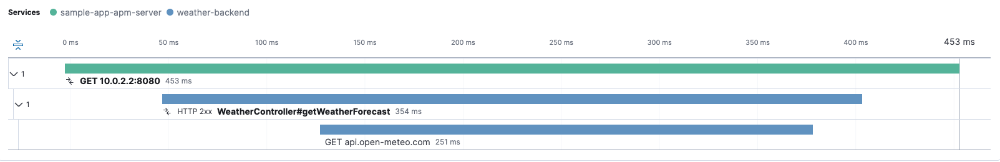

# Introduction

The Elastic OTel Android Agent is an [APM](https://en.wikipedia.org/wiki/Application_performance_management) agent based on [OpenTelemetry](https://opentelemetry.io/) . It provides built-in tools and configurations to make the [OpenTelemetry SDK](https://opentelemetry.io/docs/languages/java/) work with your {{stack}} using as little code as possible while fully leveraging the combined forces of [Elasticsearch](https://www.elastic.co/elasticsearch) and [Kibana](https://www.elastic.co/kibana) for your Android application.

## What can I do with it?

All the features provided by the [OpenTelemetry SDK](https://github.com/open-telemetry/opentelemetry-java) are available for you to use and are pre-configured by the agent to work properly out of the box. This enables you to fulfill various use cases to better understand your app's performance, such as:

### Distributed tracing

Distributed tracing allows you to see the full picture of **how long your application has to wait for your backend services** to provide a response (and why), as shown in the example below:

% TO DO: Use `:class: screenshot`

The previous image shows **3 spans** from {{kib}}:

- The first span is created in your application to track an HTTP request to your backend service.
- The second span is created within your backend service and shows how long it took to receive the client request and provide a response.
- The last span is also created within your backend service when it queries other resources internally. In this case, it makes an HTTP request to another service, but in other cases, it could involve querying a database.

You can click on any of these spans to view their full details if you need more contextual information from each.

:::{note}
For distributed tracing to work properly, your backend services must be configured to send telemetry to the {{stack}} as well.
:::

### Session review

The agent attaches [session](#session) information to each span and log generated from your application. This allows you to create queries that group all the telemetry that belongs to a session and form a session event timeline. This is useful to identify the most common actions performed by your users, as well as tracing the steps leading up to errors they may encounter.

For example, let's say you have a screen "A" in your app that can be opened from other screens, such as "B". If you create a log event when the user clicks on a button on screen "B" that takes them to screen "A", along with a log when screen "A" opens (or a span if you'd like to measure how long it takes for screen "A" to fully load), both items will contain a `session.id` attribute with the same value per session. This enables you to create {{es}} queries, for example in {{kib}}'s [Discover tool](https://www.elastic.co/guide/en/kibana/current/discover.html), to list all events during that session and better understand a user's journey within your application.

### More

Since the agent not only configures the [OpenTelemetry SDK](https://opentelemetry.io/docs/languages/java/) but also provides [direct access](manual-instrumentation.md) to its features, you can generate your own data in ways that best suit your needs and take advantage of {{stack}}'s tools, such as:

 * [Creating alerts](https://www.elastic.co/guide/en/kibana/current/alerting-getting-started.html) when something interesting happens (for example, when an error is recorded)
 * [Building custom dashboards](https://www.elastic.co/guide/en/kibana/current/dashboard.html) to display your data the way you need to see it
 * [Much more](https://www.elastic.co/kibana/features)

## Features

The agent offers additional features on top of those that come with the [OpenTelemetry SDK](https://opentelemetry.io/docs/languages/java/).

### Disk buffering

Your application's telemetry data is stored locally before being sent to the {{stack}}. Then it is removed either after being successfully exported or to make room for new telemetry data if needed. This minimizes the risk of data loss due to internet connectivity issues.

### Real time

For [distributed tracing](#distributed-tracing) to work properly, your application's time should be in sync with the [coordinated universal time](https://en.wikipedia.org/wiki/Coordinated_Universal_Time). This is sometimes an issue for Android applications, as the time provided by the OS is often not accurate enough. The agent aims to synchronize telemetry timestamps with the universal time to ensure a reliable view of event timelines.

### Session

A session groups telemetry data within a time frame when your application is active (presumably to carry out a single task, operation, or goal) by adding a `session.id` attribute to all the spans and logs that come out of your application. This helps limit the volume of data you need to look at when investigating the steps that led to an error within your app. It can also give you insight into the common actions performed on each use.

A session is created when no previous session exists or when the previous one has expired. Sessions expire after 30 minutes of inactivity (meaning that for those 30 minutes there was no telemetry generated), which can be extended up to 4 hours in case that there's always telemetry data getting generated during that time.

### Dynamic configuration

The agent allows you to modify some values after the initialization has finished. More info on the [configuration](configuration.md) page.

### Automatic instrumentation

The agent provides extensions that automatically generate telemetry for common tools and use cases. Find more information in [Automatic Instrumentation](automatic-instrumentation.md).
