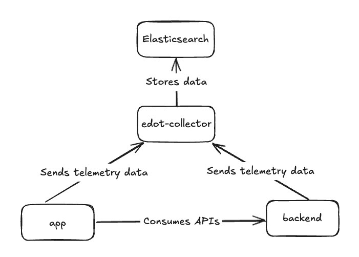

# Sample application

To showcase an end-to-end scenario including distributed tracing we'll instrument this sample
weather application that comprises two Android UI fragments and a simple local backend
service based on Spring Boot.

## Components



### Backend service

Located in the [backend](backend) module. This is a simple local backend service based on Spring
Boot that provides APIs for the application and helps showcasing the
the [distributed tracing](https://www.elastic.co/docs/reference/opentelemetry/edot-sdks/android#distributed-tracing)
use-case.

### Android application

Located in the [app](app) module. The first screen will have a dropdown list with some city names
and also a button that takes you to the second one, where you’ll see the selected city’s current
temperature. If you pick a non-European city on the first screen, you’ll get an error from the
(local) backend when you head to the second screen. This is to demonstrate how network and backend
errors are captured and correlated.

### EDOT Collector

It collects telemetry from both the application and backend service and stores it in Elasticsearch.
The [edot-collector](edot-collector) module in this project is a helper tool that takes care of
setting up an EDOT Collector for testing purposes. Refer to
the [EDOT Collector](https://www.elastic.co/docs/reference/opentelemetry/edot-collector/) docs for
more information.

## How to run

### Prerequisites

* Java 17 or higher.
* An Elasticsearch + Kibana setup with version `8.19.0` or higher. If you don't have one yet, you
  can
  quickly create it with [start-local](https://github.com/elastic/start-local/).
* An Elasticsearch API Key. Take a look at how to create
  one [here](https://www.elastic.co/docs/deploy-manage/api-keys/elasticsearch-api-keys#create-api-key).
* An [Android emulator](https://developer.android.com/studio/run/emulator#get-started).

### Step 1: Setting your Elasticsearch properties

You must set your Elasticsearch endpoint URL
and [API Key](https://www.elastic.co/docs/deploy-manage/api-keys/elasticsearch-api-keys#create-api-key)
into the [elasticsearch.properties](elasticsearch.properties) file.

```properties
endpoint=YOUR_ELASTICSEARCH_ENDPOINT
api_key=YOUR_ELASTICSEARCH_API_KEY
```

Replace `YOUR_ELASTICSEARCH_ENDPOINT` and `YOUR_ELASTICSEARCH_API_KEY` with the respective values.

### Step 2: Launching the EDOT Collector

We're going to use the `edot-collector-launcher` script, which will:

* Download the latest EDOT Collector build.
* Create
  a [configuration file](https://www.elastic.co/docs/reference/opentelemetry/edot-collector/config/default-config-standalone#gateway-mode)
  using the values from
  the [elasticsearch.properties](elasticsearch.properties) file.
* Launch the EDOT Collector service and leave it running until manually cancelled.

#### For Windows

Execute the [edot-collector-launcher.ps1](edot-collector-launcher.ps1) script with PowerShell. You
can
learn how to do so by taking a look
at [this guide](https://learn.microsoft.com/en-us/powershell/module/microsoft.powershell.core/about/about_scripts#how-to-run-a-script).

#### For Linux and MacOS

Execute the [edot-collector-launcher](edot-collector-launcher) script. You can do so by opening up
a terminal, navigating to this directory and running the following command:

```shell
./edot-collector-launcher
```

### Step 3: Launching the backend service

We're going to use the `backend-launcher` script, which will build and run the Spring Boot backend
service.

#### For Windows

Execute the [backend-launcher.ps1](backend-launcher.ps1) script with PowerShell. You
can learn how to do so by taking a look
at [this guide](https://learn.microsoft.com/en-us/powershell/module/microsoft.powershell.core/about/about_scripts#how-to-run-a-script).

#### For Linux and MacOS

Execute the [backend-launcher](backend-launcher) script. You can do so by opening up
a terminal, navigating to this directory and running the following command:

```shell
./backend-launcher
```

### Step 4: Launch the Android application

Open up the [sample-app](.) project dir with Android Studio
and [run the application](https://developer.android.com/studio/run) in
an Android Emulator. Once everything is running, navigate around in the app to generate
some load that we would like to observe in Elastic APM. So, select a city, click Next and repeat it
multiple times. Please, also make sure to select New York at least once. You will see that the
weather forecast won’t work for New York as the city.

> [!IMPORTANT]
> Make sure you open the `sample-app` directory with Android Studio and NOT the root dir of this
> repo.

> [!NOTE]
> The reason why is recommended using an emulator is because the agent
> endpoint
> set [here](app/src/main/java/co/elastic/otel/android/sample/MyApp.kt) points to the local EDOT
> Collector service, and the backend service
> endpoint [provided here](app/src/main/java/co/elastic/otel/android/sample/network/WeatherRestManager.kt)
> also points to a local backend service. If you wanted to use a real device, you'd need to replace
> the `10.0.2.2` IP by the one of the machine where you've started the services mentioned in the
> steps
> above.

## Analyzing the data

After launching the app and navigating through it, you should be able to start seeing telemetry data
coming into your configured Kibana instance. For a more detailed overview, take a look at how
to [Visualize telemetry](https://www.elastic.co/docs/reference/opentelemetry/edot-sdks/android/getting-started#visualize-telemetry)
in the docs.